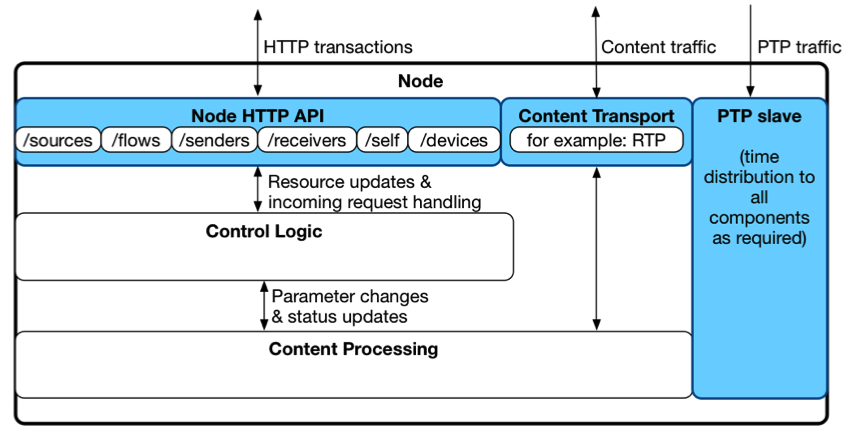
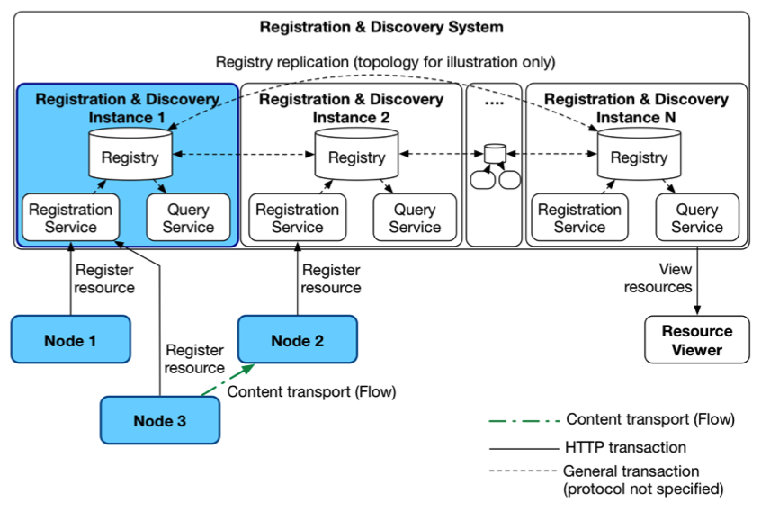

# AMWA NMOS Discovery and Registration Specification: Overview

_(c) AMWA 2016, CC Attribution-NoDerivatives 4.0 International (CC BY-ND 4.0)_

## Documentation

The documents included in this directory provide additional details and recommendations for implementations of the defined APIs, or their consumers.

Familiarity with the [JT-NM reference architecture](https://jt-nm.org/reference-architecture/) is assumed, but a summary of the resources referenced by this specification is available in the [Data Model](5.0.%20Data%20Model.md).

## Introduction

The purpose of this document is to explain how the individual entities in an NMOS system can be made discoverable.

In NMOS, all Nodes (logical hosts) expose one or more APIs:

* The [Node API](../APIs/NodeAPI.raml) is present on all Nodes to provide a means of finding the resources on each Node. The Node API also plays an important role in [Peer-to-peer discovery](3.2.%20Discovery%20-%20Peer%20to%20Peer%20Operation.md), and is expected to be used by future NMOS specifications, e.g. for connection management.
* The [Registration](../APIs/RegistrationAPI.raml) and [Query](../APIs/QueryAPI.raml) APIs are present on Nodes that enable registry-based discovery.

## Requirements on Nodes

A Node MUST implement the [Node API](../APIs/NodeAPI.raml).

A Node MUST attempt to interact with the [Registration API](../APIs/RegistrationAPI.raml).

Clients requiring data about other Nodes in the system (such as connection managers) MUST obtain this via the [Query API](../APIs/QueryAPI.raml) if available, or by using the [Peer-to-peer specification](3.2.%20Discovery%20-%20Peer%20to%20Peer%20Operation.md) in smaller networks.

### Node Structure

Regardless of their implementation, viewed logically, Nodes provide:

* An HTTP API to allow clients to view and manipulate the Node data model.
* Interfaces (in the logical sense) through which content is transported.
* A PTP slave for timing and synchronization.

More detail on the Node HTTP API is contained in the [Node API specification](../APIs/NodeAPI.raml).

NMOS does not specify the internal interfaces within a Node.

## Registering and Discovering Nodes

The Registration and Discovery Specification describes two mechanisms for discovery of Nodes and their resources: **peer-to-peer** and **registered**. Note that these two mechanisms may co-exist if this is operationally useful.

### Peer-to-Peer Discovery

Peer-to-peer (P2P) discovery requires no additional infrastructure. Nodes make DNS Service Discovery (DNS-SD) announcements regarding the presence of their Node API. Peers browse for appropriate DNS records and then query the Node HTTP API for further information.

### Registered Model

Registered discovery takes place using a **Registration & Discovery System (RDS)**, which is designed to be modular and distributed. An RDS is composed of one or more **Registry & Discovery Instances (RDIs)**. Each RDI provides:

* A **Registration Service**
* A **Query Service**
* A **Registry** storage backend.

The Registration Service implements the Registration API of the NMOS Discovery and Registration Specification. Nodes POST to this API to register themselves and their resources. The Registration Service also manages garbage collection of Nodes and their resources by requiring Nodes to send regular keep-alive/heartbeat messages.

The Query Service implements the Query API of the NMOS Discovery and Registration Specification. Clients can GET lists of resources from this API. Typical usage examples include:

* Obtaining a list of registered Nodes in order to drive a configuration interface.
* Obtaining a list of Sender resources and a list of Receiver resources in order to provide a connection management interface.

The Query API also provides the ability to generate ‘long lived’ queries using its Subscription mechanism and WebSockets.

### Examples

The diagram below shows examples of peer-to-peer and registered discovery.

