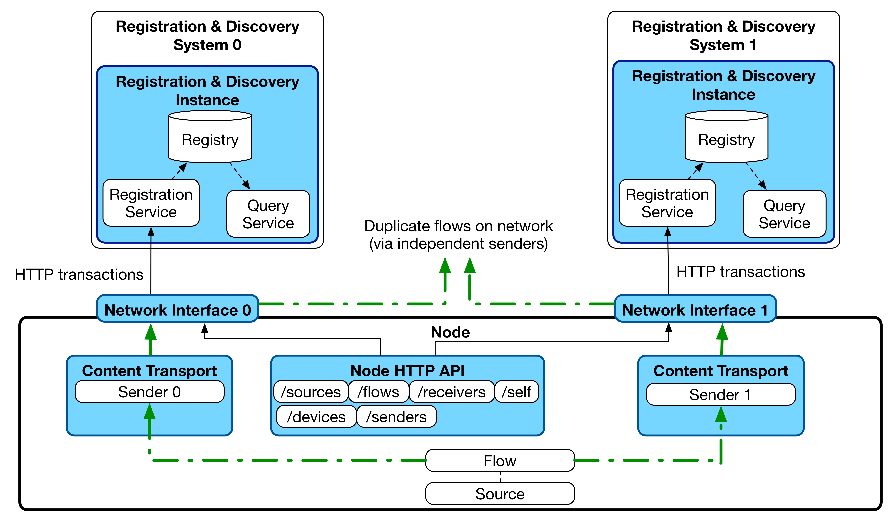

# Behaviour: Registration

_(c) AMWA 2016, CC Attribution-ShareAlike 4.0 International (CC BY-SA 4.0)_

This document covers expected client and server behaviour for interactions between a Node (the client) and the Registration API (the server).

## Standard Registration Sequences

### Initial Registration

#### Generic Node Behaviour

The following behaviour assumes a Node with a single network interface for all traffic, or one which uses a single network interface for control and other interfaces for media traffic. It is expected that registrations take place via a single interface in both of these cases.

1. A Node is connected to the network
2. The Node runs an HTTP accessible Node API.
3. The Node produces an mDNS advertisement of type '\_nmos-node.\_tcp' in the '.local' domain as specified in [Node API](../APIs/NodeAPI.raml).
4. The Node performs a DNS-SD browse for services of type '\_nmos-registration.\_tcp' as specified in [Discovery: Registered Operation](3.1.%20Discovery%20-%20Registered%20Operation.md).
5. The Node registers itself with the Registration API by taking the object it holds under the Node API's /self resource and POSTing this to the Registration API.
6. The Node persists itself in the registry by issuing heartbeats as below.
7. The Node registers its other resources (from /devices, /sources etc) with the Registration API. Note that resources must be registered in the correct order, such that a Receiver which references a device_id is registered after that corresponding Device (for example).

#### Resilient Node Behaviour

In some deployments, it may be desirable to send multiple copies of essence (video/audio/data) via redundant paths in order to provide guarantees about availability. In these situations, it is likely that a single Node will be used at the point of content creation and transmission via the two paths, and again a single Node used for reception from the two paths.

The data model employed by NMOS allows for this situation by modelling a single Flow sent via two independent Senders which are assigned to separate physical network interfaces on a Node.

This mode of operation is applicable to both the 'Peer to Peer' and 'Registered' discovery case. It is also envisaged in the Registered case that operation may be desirable with a single registry, or with two which operate totally independently on the two different networks.

In order to support this mode and ensure persistence in the registry upon link failure, a Node operating in this mode may register with Registration APIs (and host its Node API) via multiple independent network interfaces. In the case where separate registries are deployed for the multiple network links the Node must ensure it registers the correct 'href' with each registry (see [Node API](../APIs/NodeAPI.raml) /self resource). From v1.1, the 'api' attribute of the Node /self resource adds the capability to list multiple endpoints for the same Node API, removing the requirement for this 'href' specialisation.

### Heartbeating

Nodes are expected to peform a heartbeat every 5 seconds by default.

Registration APIs should use a garbage collection interval of 12 seconds by default (triggered just after two failed heartbeats at the default 5 second interval).

It is recommended that heartbeat and garbage collection intervals are user-configurable to non-default values in Nodes and Registration APIs respectively.

Nodes are only required to perform a heartbeat to maintain their 'Node' resource in the Registration API. If heartbeats fail over a period greater than the garbage collection interval, both the Node and all registered sub-resources should be removed from the registry automatically.

### Controlled Unregistration

Nodes should attempt to remove themselves from the registry cleanly on shutdown. This requires HTTP DELETE requests to be made for each resource registered via the Registration API. These DELETEs should be carried out on child resources followed by their parents (e.g. Sources which have child Flows are deleted after their children etc.)

If a Node unregisters a resource in the incorrect order, the Registration API MUST clean up related child resources on the Node's behalf in order to prevent stale entries remaining in the registry.

Following deletion of all other resources, the Node resource may be deleted and heartbeating stopped.

### Uncontrolled Unregistration

It is expected that some types of Node will be unable to unregister themselves in a clean manner, particularly in cases where a network cable is unplugged. In order to prevent stale resources remaining in the registry, a garbage collection procedure as specified in the 'Heartbeating' section above should be employed by registry implementers.

### Network Disconnect / Reconnect

If a network cable is temporarily unplugged, dependent on the time for which it remains unplugged and the settings used by the registry, the Node may or may not have remained registered when it comes back online. In order to confirm this, when a Node comes back onto the network it should carry on as if the connection had not been interrupted and issue heartbeats. If an error response is returned for these heartbeats the Node should proceed as described in the 'Error Conditions' section below.

## Error Conditions

The following error conditions describe likely scenarios encountered by Nodes when interacting with a Registration API. It is expected that all Node implementations handle these in a sensible fashion as described below.

### Node Encounters HTTP 200 On First Registration

If a Node is restarted, its first action upon discovering a Registration API is to register its 'Node' resource. On first registration with a Registration API this should result in a '201 Created' HTTP response code. If a Node receives a 200 code in this case, a previous record of the Node can be assumed to still exist within the network registry. In order to avoid the registry-held representation of the Node's resources from being out of sync with the Node's view, an HTTP DELETE should be performed in this situation to explicitly clear the registry of the Node and any sub-resources. A new Node registration after this point should result in the correct 201 response code.

### Node Encounters HTTP 400 (or other 4xx) On Registration

A 400 error indicates a client error which is likely to be the result of a validation failure identified by the Registration API. The same request must not be re-attempted without corrective action being taken first. Error responses as detailed in the [APIs](../APIs/2.0.%20APIs.md) documentation may assist with debugging these issues.

### Node Encounters HTTP 404 On Heartbeat

A 404 error on heartbeat indicates that the Node performing the heartbeat is not known to the Registration API. This could be as a result of a number of missed heartbeats which triggered garbage collection in the Registration API. On encountering this code, a Node must re-register each of its resources with the Registration API in order.

### Node Encounters HTTP 500 (or other 5xx), Inability To Connect, Or A Timeout On Heartbeat

A 500 error, inability to connect or a timeout indicates a server side or connectivity issue. As this issue may affect just one Registration API in a cluster, it is recommended that clients identify another Registration API to use from their discovered list. The first interaction with a new Registration API in this case should be a heartbeat to confirm whether the Node is still present in the registry.

When performing the initial heartbeat with a new Registration API, a 200 code indicates that the Node and its resources are still present in the registry cluster and no further action is required. Future registrations and heartbeats should be performed against this new Registration API. If a 404 code is encountered when performing this heartbeat, refer to 'Node Encounters HTTP 404 On Heartbeat' above.

Should a 5xx error be encountered when interacting with all discoverable Registration APIs it is recommended that clients implement an exponential backoff algorithm in their next attempts until a non-5xx response code is received.
