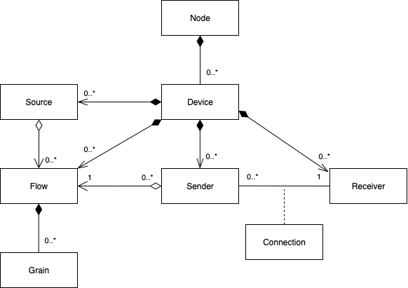

# Data Model

_(c) AMWA 2016, CC Attribution-NoDerivatives 4.0 International (CC BY-ND 4.0)_

## Data Model Overview

NMOS uses a logical data model based on the [JT-NM Reference Architecture](http://www.jt-nm.org/reference-architecture/) to add identity, relationships and time-based information to content and broadcast equipment. Hierarchical relationships group related entities, with each entity having its own UUID (ID and UUID are used interchangeably in this specification).

The traditional assumption of *"different connectors for different signals"* is replaced by the use of logical interfaces on common network interfaces, exposing video, audio and data inputs and outputs, and control parameters. This makes communication easier and helps with virtualization of broadcast equipment, with multiple devices operating on a shared physical host.

Data modeling -- identifying the important parts of a system and the relationships between them -- has an essential role to play in specifying what goes over the logical interfaces and will be an essential part of the transition of broadcasting and media production infrastructure to make the most of IP.

The data model used by the NMOS specifications is outlined below.

### Node

**Nodes** are logical hosts for processing and network operations. They may have a permanent physical presence, or may be created on demand, for example as a virtual machine in a cluster or cloud. Connections between Nodes through which content is transported are created to build a functioning broadcast plant.

### Devices

Nodes provide **Devices**, which are logical groupings of functionality (such as processing capability, network inputs and outputs).

### Sources, Flows and Grains

Devices with the capability to originate content must provide an abstract logical point of origin for this, called a **Source**. A Device may have multiple Sources.

Sources are the origin of one or more **Flows**, which are concrete representations of content.

Flows are composed of sequences of **Grains**. A Grain represents an element of Essence or other data associated with a specific time, such as a frame, a group of consecutive audio samples, or captions.

Grains also contain metadata information that specifies attributes such as the temporal duration of the payload, useful timestamps, originating Source ID and the Flow ID the grain is associated with.

As an example, consider the above concepts in the context of a video camera with an on-board microphone:

-   The camera itself is a Node, which provides a single Device with two Sources (one audio Source, one video Source).

-   The audio Source provides a single audio Flow.

-   The video Source provides (for the purposes of this example) two video Flows, one uncompressed, the other mezzanine encoded.

**Important Note:** Flows do not simply represent network streams, but the representations of media as it is handled internal to Devices. A Flow may exist without being advertised via a Sender or streamed over a network.

### Senders and Receivers

Devices transmit and receive Flows over the network using **Senders** and **Receivers.** These can be considered as "virtual output ports" and "virtual input ports" on the Device. Receivers connect to Senders in order to transport content.
