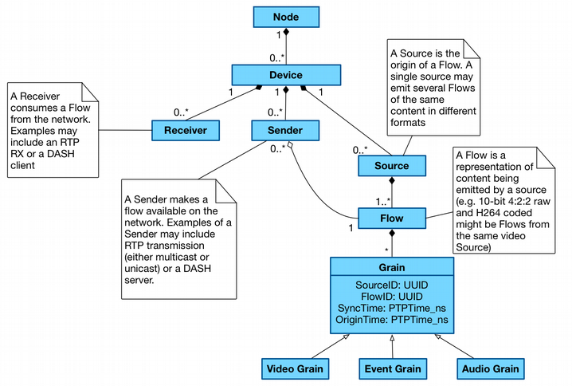
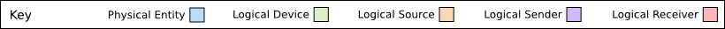
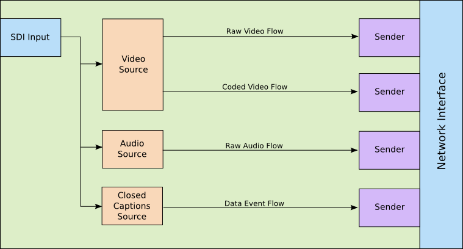
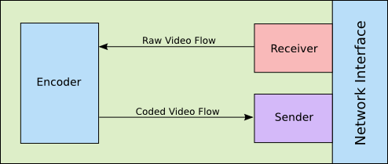
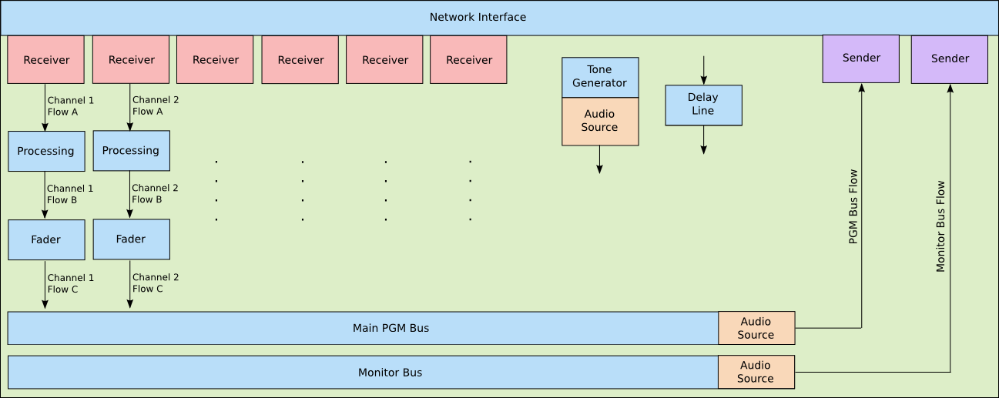
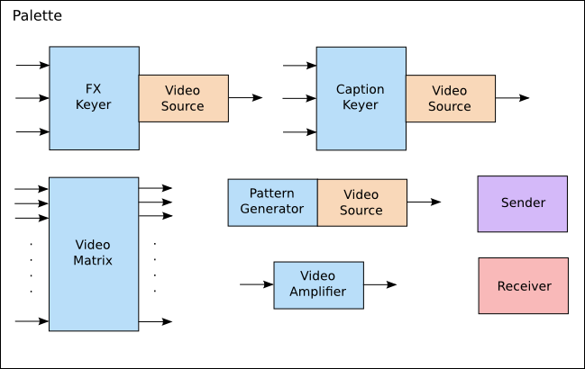
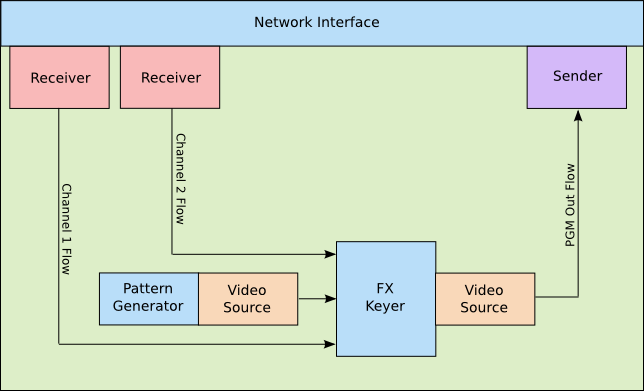

# Data Model: Identifier Mapping

_(c) AMWA 2016, CC Attribution-NoDerivatives 4.0 International (CC BY-ND 4.0)_

Identity is a core part of a flexible architecture for networked media. Associating IDs and timestamps with essence at the point of capture provides us with the capability to track a video frame or other content's ancestry through the production chain and back to the device which originally captured it. Definitions for each of the logical entities described here is available via the [JT-NM reference architecture](https://jt-nm.org/reference-architecture/).

In order to ensure consistent behaviour in a production facility employing this identity, some rules apply when generating and handling identifiers.

Implementing identity in many Devices is relatively straightforward, however for more complex multi-stage Devices (for example vision and audio mixers) there is more to consider. It is important that all editorial and transformative changes made to essence are represented by the identity model. As such, new Sources and/or Flows MUST be generated for a number of internal operations carried out by Devices.

In addition to the potential creative benefits of tracking identity, some operational tasks can be simplified. For example, a camera's tally light can be instructed to watch for the ID of its video Source forming an ancestor of the vision mixer's PGM Out Source, and switching on whenever this is the case.

## Identity Hierarchy

All resources shown above are part of the JT-NM reference architecture. Each logical entity (aside from the Grain and its descendants) is identified by a UUID and a version, with the version changing whenever a modification is made to the resource's metadata (such as a Flow label, Sender description etc).

## Source and Flow Representation

### Sources

A new Source is created in the following circumstances:

- At the input of essence into a networked media enviroment from the 'edge' (ie. a legacy or incompatible protocol)
- At the point of capture (ie. in a network connected camera or microphone)
- At the mix point of two or more Flows of essence (ie. an audio mix bus, vision mix bus)
- Where a multiplexed Source is split into multiple mono-essence Sources
- Where a set of Flows are combined as a single multiplexed Source

Whenever a new Source is generated, its immediate parent Source(s) MUST be recorded. This is achieved via a `parents` attribute in the Node API Sources resource. This contains an array of Source IDs corresponding to the Sources whose Flows have been brought together at this point. For example, a vision mixer which is fading between a Flow from Source A, and a Flow from Source B would indicate ["A", "B"\] in its `parents` attribute for the duration of this transition.

### Flows

A new Flow is created in the following circumstances:

- Where a Flow passes through a processing element which is modelled as a new Source
- Where a Flow is modified in a non-editorial manner (ie. audio volume changed, EQ applied, video contrast changed, video encoded or decoded)

Note that in order to avoid creating a new Flow after every single processing element held within a Device, processing blocks can be logically grouped together provided it will never be possible to use a Flow from part way through the processing block. For example, a three band EQ block within an audio mixer will cause a new Flow to be generated. Creating a new Flow after each EQ band is an option, but as these Flows could never be used directly anywhere else internal or external to the Device the representation of it is of no benefit. It is however important to register the EQ process as a whole as a new Flow as it might be possible to route the pre-EQ and post-EQ essence to a Sender, or to a mixing element within the Device.

Sources and Flows MUST be advertised via a Node's API, and registered via the Registration API if available. This SHOULD only be done on the Device which originates the Source or Flow; if a Flow is received by a Device from the network it does not need to be re-advertised via APIs.

Whenever a new Flow is generated, its immediate parent Flow(s) MUST be recorded. This is achieved via a `parents` attribute in the Node API Flows resource. This contains an array of Flow IDs corresponding to the Flows which have been brought together at this point. For example, an encoder which codes a raw video Flow C into a coded video Flow D would indicate `["C"]` in its `parents` attribute.

**Important Note:** A processing element which has a 1:1 input to output relationship and doesn't make editorial changes only need create a new Flow ID on output and not a new Source ID. As a Flow ID descends from a single consistent Source ID, the Flow ID for these processing elements MUST be generated based on seed data including the incoming Flow ID. If this dynamic Flow generation cannot be achieved, the processing element MUST be viewed as a new Source instead (see Flow ID section below).

## Identifier Persistence & Generation

Persistent identity helps to ensure that users' expectations meet with reality. For example, if a piece of equipment is switched off and back on, the user would expect it to return with the same signals routed to and from the same ports. A control system managing this can only do so if the identifiers used by the Node remain the same.

UUIDs are used throughout the NMOS data model, and can be generated in a number of ways (including from hardware addresses) in order to achieve consistent behaviour (see [RFC 4122](https://tools.ietf.org/html/rfc4122)).

### Node ID

For physical Nodes, the Node ID MUST be universally unique to that Node, and remain the same for all time (much in the same way as a serial number).

For virtual Nodes, the Node ID MUST be universally unique to that Node. If a snapshot is taken of a virtual Node and the snapshot re-deployed:

- If re-deploying via the same controller which created it and no other instantiation of this virtual Node exists, the original Node ID SHOULD be used.
- If re-deploying via the same controller which created it and an instantiation of this virtual Node exists, it MUST be deployed with a new ID. Uses of this Node ID (and child resources) in any other stored data MUST be mapped to the new ID during this process.
- If re-deploying via a different controller and it cannot be guaranteed that another instance of this virtual Node does not already exist, a new Node ID MUST be generated, with any stored data being mapped to the new ID during the process.

To simplify the above for deploying snapshots, each instantiation of a virtual Node snapshop MAY have a new Node ID. In such a case, a mapping MUST be provided to translate between old and new IDs so that session / production / automation data remain relevant.

### Device ID

Owned by:

- Node ID

SHOULD change if:

- The same Device configuration operates on a different Node
- A duplicate of the Device operates at the same time as the original instantiation

SHOULD NOT change if:

- The same Device configuration is re-loaded onto the same Node after a reboot or similar

It is suggested that Device IDs be generated using the combination of:

- The parent Node ID
- A Device serial number if available in the case of physical systems, or a persistent identifier or index created upon Device instantiation in the case of virtual systems

### Source ID

Owned by:

- Device ID

SHOULD change if:

- Device ID changes
- A different physical interface (such as an SDI input) is used to retrieve essence
- Format URN changes between `video`, `audio`, `data` and `mux` variants

SHOULD NOT change if:

- Configuration parameters associated with the Source are changed, such as its operating resolution or bitrate
- Labels, descriptions or other metadata associated with the Source resource are modified

It is suggested that Source IDs be generated using a combination of:

- The parent Device ID
- A processing element type and index (or name) within the Device
- A processing element Source index (or name)

### Flow ID

Owned by:

- Source ID

SHOULD Change if:

- Source ID changes
- Format URN changes between `video`, `audio`, `data` and `mux` variants (including between two codec types)

SHOULD NOT change if:

- Configuration parameters associated with the Flow are changed, such as its operating resolution or bitrate
- Labels, descriptions or other metadata associated with the Flow resource are modified

It is suggested that Flow IDs be generated using the combination of:

- The parent Source ID
- A processing element type and index (or name) within the Device
- A processing element Flow index (or name)\
- Parent Flow ID\*\*

    \*\*Only in cases where a new Flow ID is generated as the result of a 1:1 transformation (such as an encode) rather than a many-to-one transformation (such as a vision mix).

### Sender ID

Owned by:

- Device ID

SHOULD change if:

- Device ID changes
- Transport type URN changes

SHOULD NOT change if:

- Flow ID it is sending changes
- A virtual Device is re-configured, adding or removing some Senders, but keeping this one

It is suggested that Sender IDs be generated using the combination of:

- The parent Device ID
- An output connection identifier such as a bus name, index or similar

### Receiver ID

Owned by:

- Device ID

SHOULD change if:

- Device ID changes
- Transport type URN changes
- Supported data format URN changes between `video`, `audio`, `data` and `mux` (including between two codec types)

SHOULD NOT change if:

- Sender ID it is receiving from changes
- A virtual Device is re-configured, adding or removing some Receivers, but keeping this one

It is suggested that Receiver IDs be generated using the combination of:

- The parent Device ID
- An input connection identifier such as a channel name, index or similar

## Virtual Identifiers

In systems which are heavily re-configurable such as an IT virtualisation platform, it might not be possible to generate identifiers based on fixed hardware. This inability to re-generate the same IDs for the same processing elements indicates a need for some form of persistent storage in order to make the identifiers useful over a period of time longer than a single production deployment.

Consider for example a TV production using a re-configurable studio facility. The recording is split over a few weeks, with a gap of three days in the middle where the physical studio floor is in use by another production. It is necessary to 'spin down' the virtual infrastructure in use during this period so that it can be used by others. When spinning it back up again, all connections between senders and receivers will typically be re-instated, and all recorded metadata will need to be relatable to the previous recording period. By persisting the identifiers used in the previous production this is very straightforward (although the requirements for identifier re-generation as specified under the Node ID heading above need to be observed, and mappings applied where necessary).

## Real-World Identity Examples

These examples demonstrate how to apply identity to Devices in real world applications:

### Edge Device: Camera or SDI to IP Converter

System

- Fixed Node ID
- Fixed Device ID

Input

- SDI or Camera Sensor

Output

- Fixed Source IDs
- Fixed Flow IDs
- Fixed Sender IDs

### Processing Device: Hardware IP Codec

System

- Fixed Node ID
- Fixed Device ID

Input

- Fixed Receiver ID

Output

- Flow ID generated based on input Flow ID (see *Source and Flow
    Representation* above)
- Fixed Sender ID

### Processing Device: Hardware Audio Mixer

NB: A new Flow is created following each processing element where a tap off could be taken, even if it isn't being taken at that moment. For example, a pre-fade version of Channel 1 could be taken to the monitor bus post-processing (EQ), so a new Flow is created here. The key is to distinguish this Flow as different from the post-fade version which might not have identical content. If a Flow receives a time domain modification (Grain sync timestamp change, or delay applied), no data model changes are needed as the Grain origin timestamps still uniquely identify it within the originating Flow. At mix points and where data is generated from a control signal (such as a tone generator) a new Source is also created.

System

- Fixed Node ID
- Fixed Device ID

Channel Strip

- Fixed Receiver ID
- Input dependent Flow ID following each self-contained processing element (see *Source and Flow Representation* above)

Tone Generator

- Fixed Source ID
- Fixed Flow ID

Delay Line

- Output Source and Flow ID match input

PGM Bus

- Fixed Source ID and Flow ID
- Fixed Sender ID

Monitor Bus

- Fixed Source ID
- Fixed Flow ID
- Fixed Sender ID

During operation, as with any other fixed hardware Device there is little need to generate new identifiers as they can be baked into the Device at manufacture. Changes will however be needed to the ancestry recorded against Flows and Sources within the API (and network registry if applicable). These changes will occur whenever a modification is made to bus routing, such as pressing a PFL button or linking a channel to a particular group.

Metering isn't shown in this example, but could be shown to take an audio Flow as input, create a new metering data Source and Flow, and pass this data on to a Sender for transmission to the network as a series of measurements.

### Processing Device: Virtual Vision Mixer on Fixed Hardware Node

This example covers a more flexible setup where the configuration of Devices is determined on a more freeform basis using logical processing blocks which can be assembled based on the user's requirements. Fundamentally this works in the same way as previous examples.

The user starts out with a palette of components which can be attached together to create a vision mixer suitable for their requirements. Each component can either have identity associated with it permanently (if there are a limited number of each component which can be deployed), or the identifiers could be generated on the fly as a particular component is instantiated. In the latter case, whilst randomly generated identifiers could be used each time, some degree of consistency could be useful. For example the main PGM output from the mixer might be best defined with the same Sender ID each time it is instantiated so that it can easily be brought up and routed from as part of a larger studio preset. Management and generation of these identifiers is at the discretion of the implementer, but a suggested scheme might use the Device ID plus processor type or role plus an index within the Device as the seed data to generate identifiers in a consistent manner.

Note as shown in the palette where new Flows are generated as opposed to new Sources. The video amplifier creates a new Flow based on its input as whilst it is editorially the same, an effect has been applied. The video matrix does not change any identity (no new Sources or Flows) as it acts purely as a passive splitter for existing Flows. The other components shown indicate that they are a new Source, either because they combine Flows or because they generate a Flow from scratch.

Having built a vision mixer from the palette above, a simple example layout is shown below.

**Important Note:** Unlike most of the processing elements above which have a fixed output Source and Flow ID, or carry the Flow ID through from the input, the video amplifier (much like an encoder or decoder) simply generates a new Flow from the input Flow without the need for a new Source. As a Flow ID descends from a single consistent Source ID, the Flow ID for these processing elements MUST be generated based on seed data including the incoming Flow ID. If this dynamic Flow generation cannot be achieved, the processing element MUST be viewed as a new Source.

System

- Fixed Node ID

- Fixed Device ID

    NB: This assumes the mixer cannot be logically split into two distinct mixers. In this case multiple Device IDs might exist.

Inputs

- Fixed Receiver ID pool, or generated based on seed data of Device ID
    and Receiver index

Outputs

- Fixed Sender ID pool, or generated based on seed data of Device ID
    and Sender index

Pattern Generator

- Source and Flow ID generated based on seed data of Device ID, processor type and pattern generator index within Device

    Alternatively these IDs could be statically associated with a processor from the palette, rather than assigning them upon instantiation

FX Keyer

- Source and Flow ID generated based on seed data of Device ID, processor type and FX keyer index within the Device

    Alternatively these IDs could be statically associated with a processor from the palette, rather than assigning them upon instantiation
