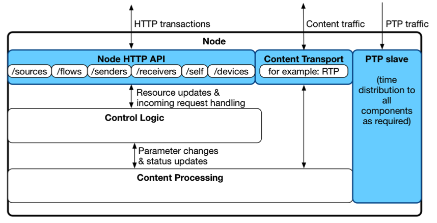
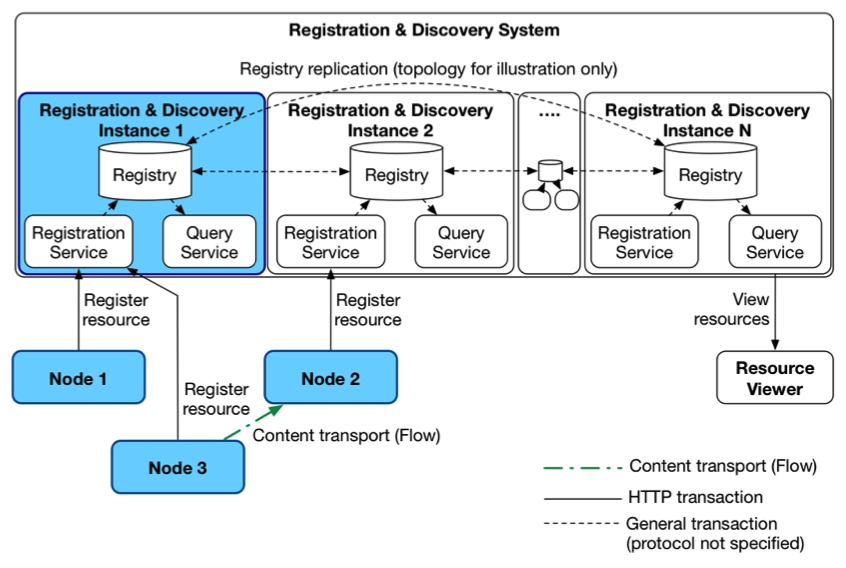
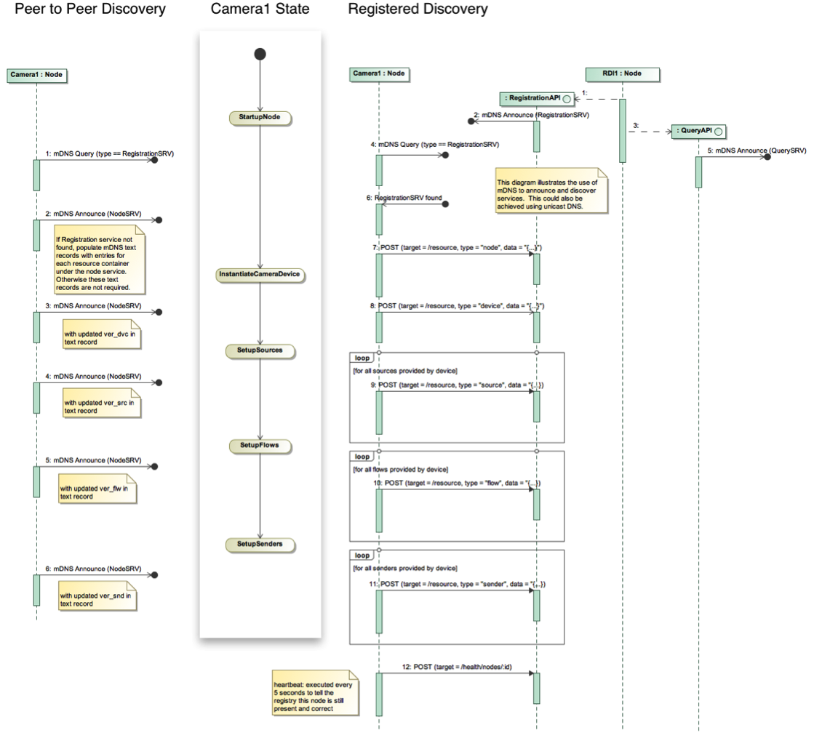

# AMWA IS-04 NMOS Discovery and Registration Specification: Overview
{:.no_toc}

- A markdown unordered list which will be replaced with the ToC, excluding the "Contents header" from above
{:toc}

<!-- _(c) AMWA 2016, CC Attribution-NoDerivatives 4.0 International (CC BY-ND 4.0)_ -->

## Introduction

AMWA IS-04 specifies how to register and discover resources in an NMOS system. IS-04 is built on three APIs:

- The [Registration API](../APIs/RegistrationAPI.raml) allows a Node to register its resources.
- The [Query API](../APIs/QueryAPI.raml) allows querying of registered resources.
- The [Node API](../APIs/NodeAPI.raml) is used to find resources on a Node, and is used for [peer-to-peer discovery](Discovery%20-%20Peer%20to%20Peer%20Operation.md)

The Specification includes:

- RAML and JSON Schema definitions, with supporting JSON examples
- This documentation set, which provides:
  - An overview of each API and how it is used.
  - Normative requirements in addition to those included in the RAML and JSON schemas specifying the API.
  - Additional details and recommendations for implementers of API providers and clients.
  - Information about compatibility between different API versions.

Familiarity with the [JT-NM Reference Architecture](https://jt-nm.org/reference-architecture/) is assumed, but a summary of the resources referenced by this specification is available in the [Data Model](Data%20Model.md).

## Use of Normative Language

The key words "MUST", "MUST NOT", "REQUIRED", "SHALL", "SHALL NOT", "SHOULD", "SHOULD NOT", "RECOMMENDED", "MAY",
and "OPTIONAL" in this documentation set are to be interpreted as described in [RFC 2119][RFC-2119].

## Requirements on Nodes

A Node MUST implement the [Node API](../APIs/NodeAPI.raml).

A Node MUST attempt to interact with the [Registration API](../APIs/RegistrationAPI.raml).

Clients requiring data about other Nodes in the system (such as connection managers) MUST obtain this via the [Query API](../APIs/QueryAPI.raml) if available, or by using the [peer-to-peer specification](Discovery%20-%20Peer%20to%20Peer%20Operation.md) in smaller networks.

### Node Structure

Regardless of their implementation, viewed logically, Nodes provide:

- An HTTP API to allow clients to view and manipulate the Node data model.
- Interfaces (in the logical sense) through which content is transported.
- A PTP follower for timing and synchronization.

More detail on the Node HTTP API is contained in the [Node API specification](../APIs/NodeAPI.raml).

NMOS does not specify the internal interfaces within a Node.

## Registering and Discovering Nodes

The Registration and Discovery Specification describes two mechanisms for discovery of Nodes and their resources: peer-to-peer and registered. These two mechanisms MAY co-exist if this is operationally useful.

### Peer-to-Peer Discovery

Peer-to-peer discovery requires no additional infrastructure. Nodes make DNS Service Discovery (DNS-SD) announcements regarding the presence of their Node API. Peers browse for appropriate DNS records and then query the Node HTTP API for further information.

### Registered Model

Registered discovery takes place using a **Registration & Discovery System (RDS)**, which is designed to be modular and distributed. An RDS is composed of one or more **Registry & Discovery Instances (RDIs)**. Each RDI provides:

- A **Registration Service**
- A **Query Service**
- A **Registry** storage backend.

The Registration Service implements the Registration API of the NMOS Discovery and Registration Specification. Nodes `POST` to this API to register themselves and their resources. The Registration Service also manages garbage collection of Nodes and their resources by requiring Nodes to send regular keep-alive/heartbeat messages.

The Query Service implements the Query API of the NMOS Discovery and Registration Specification. Clients can `GET` lists of resources from this API. Typical usage examples include:

- Obtaining a list of registered Nodes in order to drive a configuration interface.
- Obtaining a list of Sender resources and a list of Receiver resources in order to provide a connection management interface.

The Query API also provides the ability to generate ‘long lived’ queries using its Subscription mechanism and WebSockets.

### Examples

The diagram below shows examples of peer-to-peer and registered discovery.

[RFC-2119]: https://tools.ietf.org/html/rfc2119 "Key words for use in RFCs"
